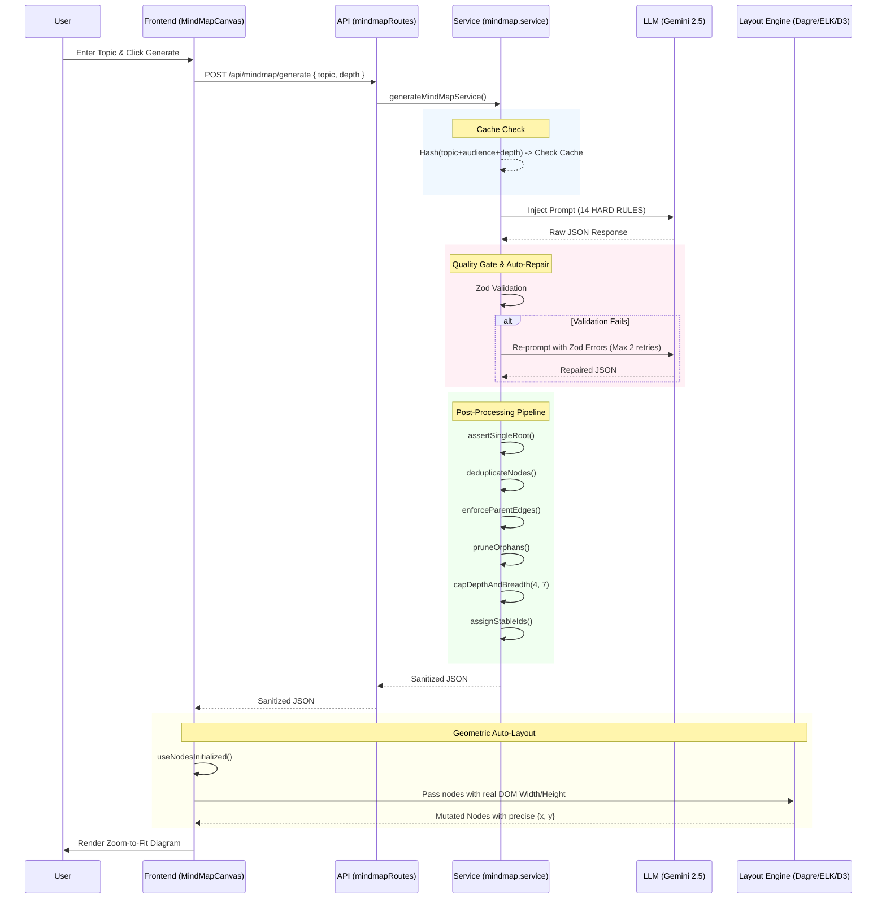

# MindMap Feature Architecture

The MindMap feature in the Edunova LMS has been completely refactored into a deterministic, high-performance, and deeply hierarchical knowledge-graph generator.

## Data Flow Diagram

The following diagram illustrates the complete end-to-end data flow when an educator requests a new MindMap.

## Core Components
1. **Canonical Data Contract**: Enforced via Zod schemas (`mindmapSchema.js`) to guarantee strict typings and object structures.
2. **AI System Prompt**: Enforces MECE (Mutually Exclusive, Collectively Exhaustive) principles, strict depth limits, and semantic node typing.
3. **Multi-Engine Auto-Layout**: Hook (`useMindMapLayout.js`) leveraging Dagre, ELK, or d3-hierarchy to mathematically space nodes based on exact DOM pixel dimensions, eliminating overlap completely.
4. **Export & LMS Integration**: Utilities (`mindmapExport.js`) to export graphs to Markdown study notes or convert topological graphs directly into nested LMS Course Outlines (Modules > Lessons > Topics).
